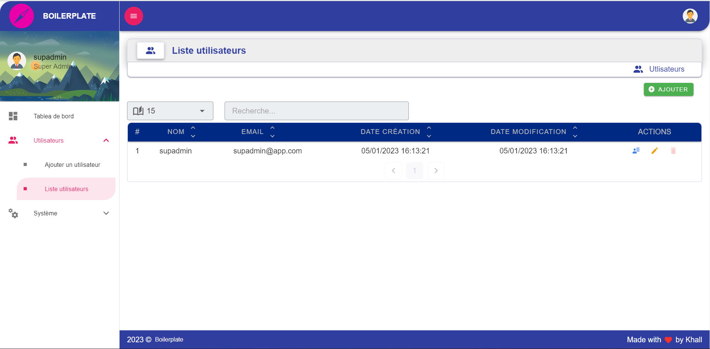
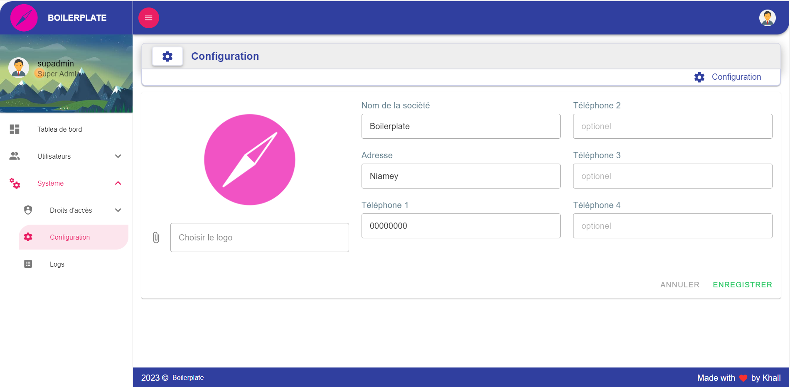
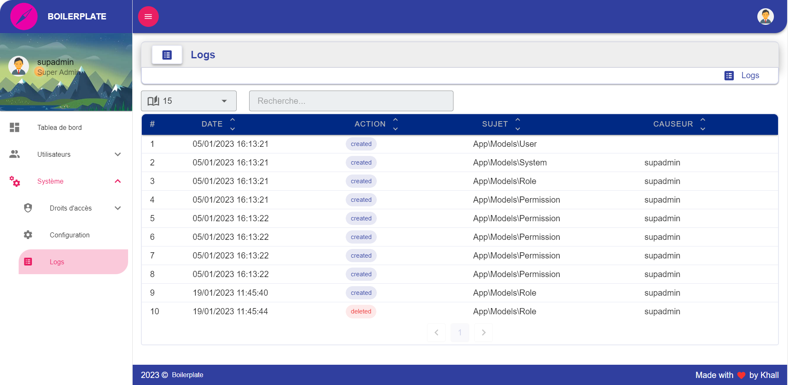

<h2>Laravel - Nuxt Boilerplate</h2>

## Setup Development

```code
> git clone https://github.com/ibkhall/laravel-nuxt.git

> composer install
> npm install
> php artisan serve
> npm run dev

```


## Screenshots

### users list



### system configs




### logs

